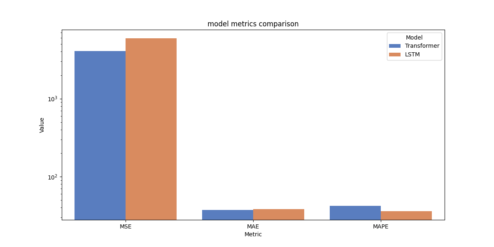
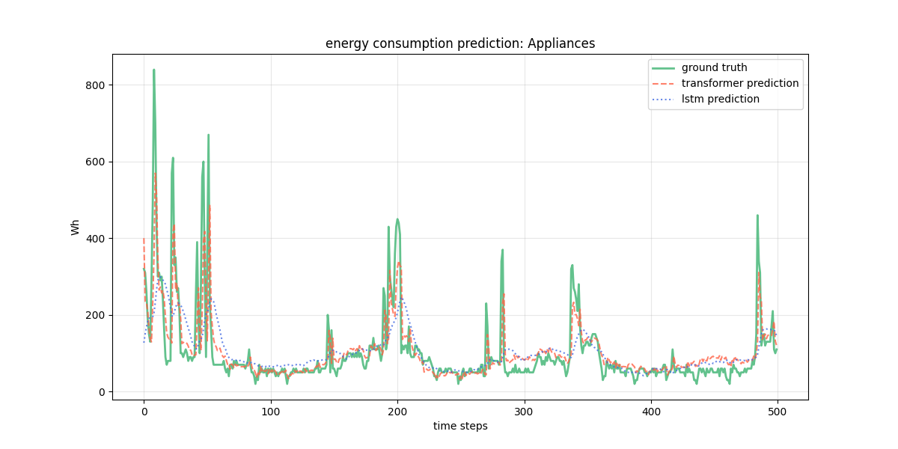
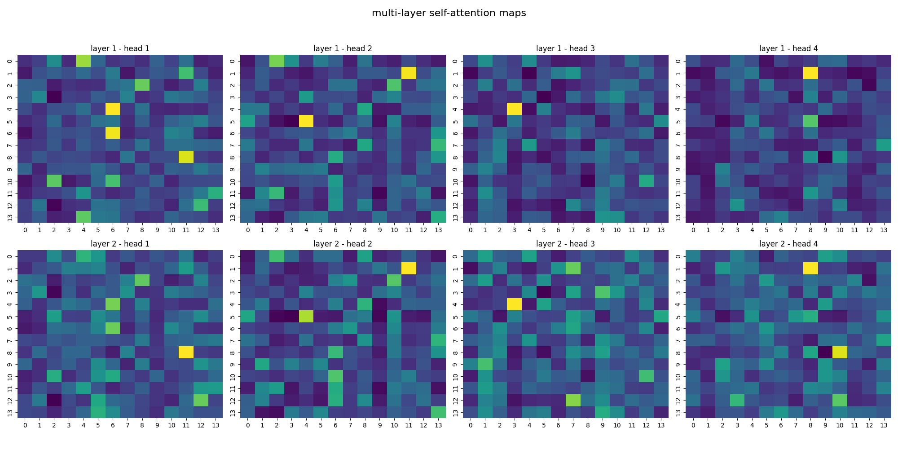
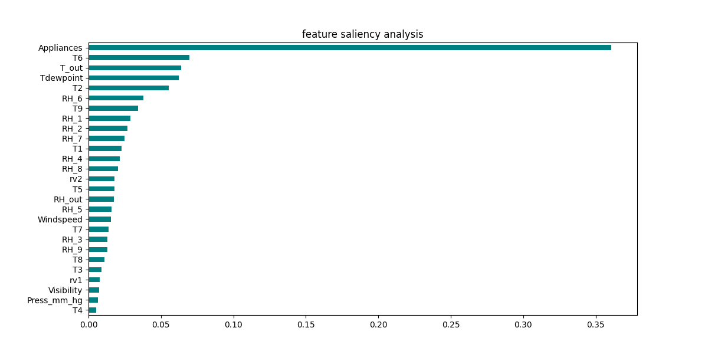
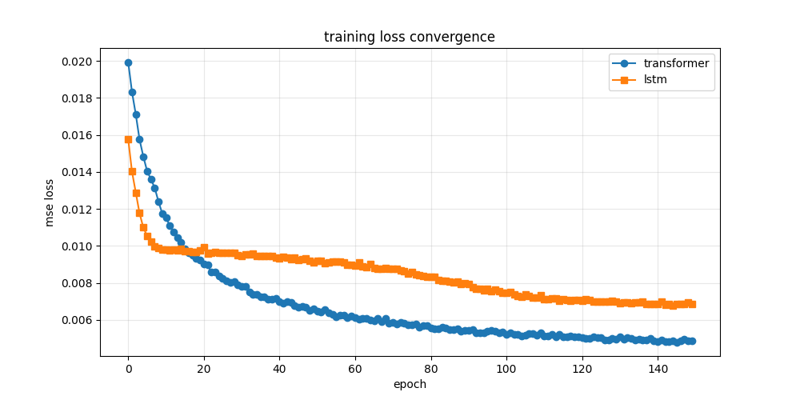
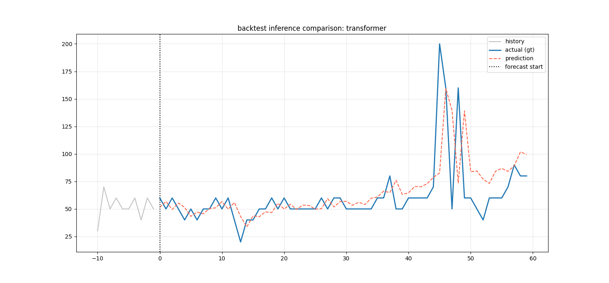
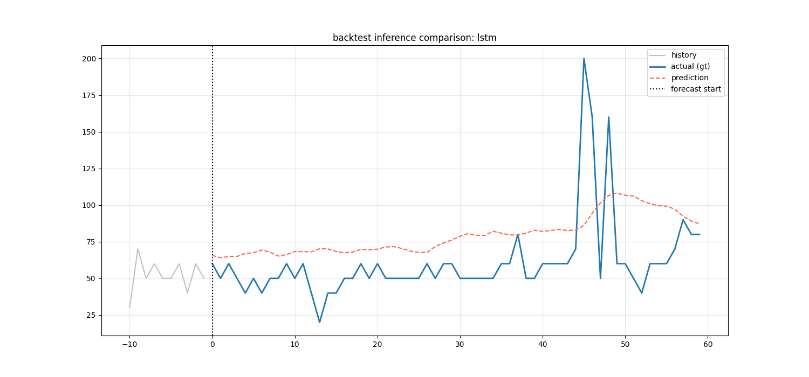

# BÁO CÁO ĐỒ ÁN: DỰ ĐOÁN NĂNG LƯỢNG TIÊU THỤ TRONG NHÀ THÔNG MINH

## Tóm tắt (Abstract)
Báo cáo này tập trung vào bài toán dự báo năng lượng tiêu thụ của các thiết bị điện trong hộ gia đình. Bằng cách sử dụng tập dữ liệu **uci appliances energy prediction**, chúng em thực hiện so sánh hiệu quả giữa hai kiến trúc mạng nơ-ron sâu phổ biến: **Transformer** và **LSTM**. Kết quả thực nghiệm cho thấy Transformer vượt trội trong việc nắm bắt các phụ thuộc dài hạn, trong khi LSTM duy trì sự ổn định tốt trong các chuỗi dữ liệu ít biến động.

---

## 1. Giới thiệu (Introduction)
* **Bối cảnh**: Sự gia tăng của các thiết bị IoT trong nhà thông minh tạo ra nhu cầu cấp thiết về việc tối ưu hóa điện năng tiêu thụ.
* **Ứng dụng**: Hệ thống dự báo giúp người dùng tối ưu chi phí và hỗ trợ các đơn vị vận hành lưới điện dự báo phụ tải.
* **Mục tiêu**: Xây dựng mô hình hồi quy đa biến có khả năng dự báo mức tiêu thụ điện dựa trên các yếu tố môi trường (nhiệt độ, độ ẩm).

---

## 2. Tổng quan lý thuyết (Related Work / Background)
* **Dự báo chuỗi thời gian**: Khác với bài toán Computer Vision, dự báo chuỗi thời gian tập trung vào việc mô hình hóa các phụ thuộc theo thời gian của dữ liệu bảng.
* **Phương pháp**:
    - **LSTM**: Một dạng mạng nơ-ron hồi quy đặc biệt, giải quyết hiệu quả vấn đề mất mát đạo hàm thông qua các cổng (gates).
    - **Transformer**: Kiến trúc hiện đại dựa trên cơ chế Self-Attention, cho phép xử lý song song và nắm bắt ngữ cảnh toàn cục hiệu quả hơn RNN.
* **Lý do chọn**: Chúng em chọn Transformer để đánh giá khả năng của cơ chế Attention so với cách tiếp cận tuần tự truyền thống của LSTM trong bài toán năng lượng.

---

## 3. Dataset & Tiền xử lý dữ liệu
### 3.1 Dataset
* **Tên dataset**: uci appliances energy prediction
* **Số lượng mẫu**: 19735 bản ghi thực tế.
* **Số lượng biến**: 27 đặc trưng môi trường đầu vào.
* **Định dạng nhãn**: Giá trị thực (Wh) biểu thị năng lượng tiêu thụ của Appliance.

### 3.2 Tiền xử lý
* **Normalize**: Áp dụng `MinMaxScaler` để đưa toàn bộ dữ liệu về khoảng [0, 1] nhằm tăng tốc độ hội tụ.
* **Sliding Window**: Sử dụng cửa sổ 14 bước thời gian quá khứ để dự báo giá trị tại bước tiếp theo.
* **Chia tập dữ liệu**: Train 79% và Test 21% (chia theo trình tự thời gian để đảm bảo tính khách quan của dự báo).

---

## 4. Phương pháp đề xuất (Methodology)
### 4.1 Kiến trúc mô hình
* **Backbone**: Lớp Linear Projection kết hợp với Learned Positional Encoding.
* **Mô hình chính**:
    - **Transformer**: Cấu trúc gồm 2 lớp Encoder với 4 đầu Attention song song.
    - **LSTM**: Cấu trúc gồm 2 lớp LSTM chồng nhau (stacked) với 128 đơn vị ẩn mỗi lớp.


### 4.2 Hàm mất mát (Loss Function)
* **MSE Loss**: Được chúng em sử dụng làm hàm mục tiêu để tối ưu hóa, giúp phạt nặng các sai số lớn trong dự báo năng lượng.

### 4.3 Thiết lập huấn luyện
* **Optimizer**: Adam
* **Learning rate**: 1e-05
* **Epochs**: 150
* **Batch size**: 1024

---

## 5. Thực nghiệm & Kết quả
### 5.1 Metric đánh giá
* **MSE**: Đánh giá độ lệch bình phương giữa dự báo và thực tế.
* **MAE**: Sai số tuyệt đối trung bình, cho cái nhìn trực quan về đơn vị Wh.
* **MAPE**: Đánh giá tỷ lệ phần trăm sai số, khách quan hơn khi quy mô dữ liệu thay đổi.

### 5.2 Kết quả định lượng
| Model        | MSE             | MAE             | MAPE (%)        |
| :----------- | :-------------- | :-------------- | :-------------- |
| Transformer  |         4086.69 |           37.11 |           42.13 |
| LSTM         |         5937.39 |           38.25 |           36.00 |

* **So sánh định lượng giữa các mô hình**:


### 5.3 Kết quả định tính
* **Biểu đồ dự báo trên tập Test**:


* **Phân tích Attention Maps (Multi-layer/Multi-head)**:


* **Bản đồ quan trọng đặc trưng (Saliency Maps)**:


* **Tầm quan trọng của các bước thời gian (Temporal Importance)**:


---

## 6. Phân tích & Thảo luận
* **Phân tích lỗi**: Cả hai mô hình đều gặp khó khăn khi dự báo các điểm tiêu thụ năng lượng tăng vọt đột ngột (spikes) do các yếu tố ngẫu nhiên từ con người.
* **Hoạt động kém**: Hiệu năng có xu hướng giảm khi chuỗi thời gian đầu vào chứa quá nhiều nhiễu từ các cảm biến môi trường bên ngoài.
* **Ưu điểm**: Transformer thể hiện sự nhạy bén và khả năng giải thích (interpretability) tốt hơn thông qua các trọng số Attention.

---

## 7. Kết luận & Hướng phát triển
* **Kết quả**: Chúng em đã xây dựng thành công pipeline dự báo năng lượng và so sánh chi tiết hai kiến trúc Deep Learning.
* **Bài học**: Việc xử lý đa tầng Attention giúp mô hình nắm bắt được cả xu hướng cục bộ và chu kỳ dài hạn.
* **Hướng phát triển**: Tích hợp thêm các kỹ thuật như nhúng thời gian (Temporal Embedding) để mô hình hiểu được yếu tố giờ/ngày/tháng.

---

## 8. Phụ lục (Appendix)
* **Cấu trúc thư mục code**:

```text
├── data/                    # Chứa tập dữ liệu gốc (.csv)
├── evals/                   # Lưu trữ các tệp kết quả đo đạc (.csv)
├── figures/                 # Chứa các biểu đồ so sánh, biểu đồ loss và heatmap
├── inferences/              # Kết quả dự đoán trên toàn bộ tập test
├── inferences_backtest/     # Biểu đồ mô phỏng dự đoán thực tế (backtest)
├── logs/                    # Nhật ký huấn luyện (training log dưới dạng JSON)
├── scalers/                 # Lưu trữ bộ tiền xử lý MinMaxScaler đã fit (.pkl)
├── weights/                 # Lưu trữ trọng số mô hình (.pth)
├── README.md                # Tệp báo cáo chi tiết (Markdown)
└── draft.ipynb              # Notebook chứa toàn bộ mã nguồn thử nghiệm và thực thi
```

* **Biểu đồ hội tụ Loss trong quá trình huấn luyện**:

* **Kết quả Backtest thực tế**:
    - Transformer: 
    - LSTM: 

---

## Tài liệu tham khảo (References)
1. Vaswani, A. et al. "Attention is All You Need" (2017).
2. UCI Machine Learning Repository - Appliances energy prediction.
3. PyTorch Framework Documentation & Tutorials.
